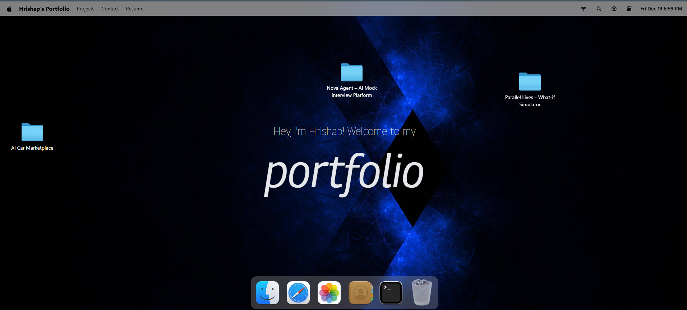

# macOS Portfolio

A modern, interactive portfolio website designed to mimic the macOS interface, built with React and cutting-edge web technologies.



## 🚀 Features

- **macOS-like Interface**: Authentic macOS desktop experience with draggable windows, dock, and navigation
- **Interactive Windows**:
  - Terminal emulator
  - Safari browser simulation
  - Resume viewer with PDF support
  - File finder/explorer
  - Text editor
  - Image gallery
  - Contact form
  - Home dashboard
- **Smooth Animations**: Powered by GSAP for fluid transitions and interactions
- **Responsive Design**: Optimized for desktop and mobile devices
- **Modern UI**: Built with Tailwind CSS for consistent styling
- **State Management**: Efficient state handling with Zustand

## 🛠️ Tech Stack

- **Frontend**: React 19
- **Build Tool**: Vite
- **Styling**: Tailwind CSS
- **Animations**: GSAP
- **Icons**: Lucide React
- **State Management**: Zustand
- **PDF Viewer**: React PDF
- **Date Handling**: Dayjs
- **Utilities**: Immer, Clsx

## 📦 Installation

1. Clone the repository:
```bash
git clone https://github.com/Hrishap/Hrishap_portfolio.git
cd Hrishap_portfolio
```

2. Install dependencies:
```bash
npm install
```

3. Start the development server:
```bash
npm run dev
```

4. Open [http://localhost:5173](http://localhost:5173) in your browser.

## 🏗️ Build & Deployment

Build for production:
```bash
npm run build
```

Preview the production build:
```bash
npm run preview
```

## 📱 Usage

- **Navigation**: Use the dock at the bottom to open different applications
- **Windows**: Drag windows around the screen, minimize/maximize/close them
- **Finder**: Explore the file system and view images
- **Resume**: View and download the resume PDF
- **Contact**: Send messages through the contact form
- **Terminal**: Interact with the terminal interface

## 🎨 Customization

The project uses Tailwind CSS for styling. Customize colors, fonts, and layout by modifying:
- `src/App.css` - Global styles
- `src/index.css` - Base styles
- Component-specific CSS classes

## 🤝 Contributing

1. Fork the repository
2. Create a feature branch: `git checkout -b feature/amazing-feature`
3. Commit your changes: `git commit -m 'Add amazing feature'`
4. Push to the branch: `git push origin feature/amazing-feature`
5. Open a Pull Request


## 👨‍💻 Author

**Hrishap**
- GitHub: [@Hrishap](https://github.com/Hrishap)
- LinkedIn: [Hrishap](https://www.linkedin.com/in/hrishap-joshi/)

---

Built with  using React and Vite
